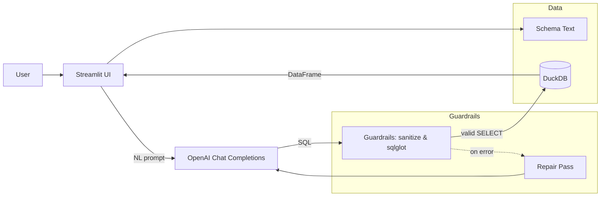
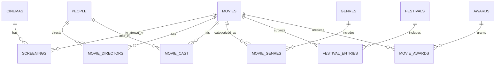

---

title: NaturalQL - Guardrailed Natural Language → SQL
tags: [LLMs, NLP, Data Engineering, DuckDB, Streamlit, Prompt Engineering]
style: fill
color: primary
description: A tiny but solid demo that turns natural language into safe SQL with guardrails, a cinema dataset, and a clean Streamlit UI
---

#### *Demo: natural-language → SQL with safety rails, small dataset, and a friendly UI.*

# Why this exists

Enter **NaturalQL**: a Streamlit app that converts natural-language questions into **safe SQL**, runs them on a small **DuckDB** database, and shows results - with **schema-bounded prompting**, **static SQL checks**, and a **single repair pass** if the first attempt fails.

> 


<figure style="margin: 2em auto; text-align: center; max-width: 100%;">
  
  <figcaption style="margin-top: 0.5em; font-size: 0.95em; color: var(--text-muted-color);">
    NaturalQL screenshot.
  </figcaption>
</figure>

---

# TL;DR - What I built

* **NL → SQL (DuckDB dialect)** using OpenAI Chat Completions
* **Guardrails**:

  * SELECT-only, **LIMIT** enforced
  * **Schema-bounded** generation (exact tables/columns passed to the model)
  * **Static validation** with `sqlglot` (alias-aware, `m.*` supported)
  * **One repair loop** using the parser error as feedback
* **Deterministic time phrases** (“this summer”, “July 2025”) resolved against a fixed demo date
* **Streamlit UI** with *Query* and *About* tabs, optional *Show SQL* and *Explain SQL*
* **Zero-ops DB**: **DuckDB** + seeded “cinema” schema that's simple yet query-rich

---

# Architecture (at a glance)



---

# The schema (why queries are fun)

We want something anyone can reason about, but rich enough to form tricky questions (debut directors, festival ranks, overlapping date windows, “cast never acted in award-winning films”, etc.).



Tables: `cinemas, movies, people, movie_directors, movie_cast, genres, movie_genres, festivals, festival_entries, awards, movie_awards, screenings`.

---

# Guardrails that keep things safe (and demo-friendly)

## 1) Sanitization

* Reject non-SELECT statements
* Strip semicolons; **enforce LIMIT** (configurable)

```python
def sanitize_sql(sql: str, limit: int) -> str:
    s = sql.strip().rstrip(";")
    if not re.match(r"(?is)^\\s*select\\b|^\\s*with\\b", s):
        raise ValueError("Only SELECT / WITH queries are allowed.")
    if re.search(r"(?i)\\b(insert|update|delete|drop|alter|create|grant|revoke)\\b", s):
        raise ValueError("Only read queries are allowed.")
    if not re.search(r"(?i)\\blimit\\b", s):
        s += f" LIMIT {limit}"
    return s
```

## 2) Static validation (sqlglot)

* Parse and walk the AST
* **Alias-aware** table/column checks
* Allow `*` and `m.*` but validate the table/alias exists

```python
tree = parse_one(sql, read="duckdb")
# …build alias map from FROM/JOIN, validate tables…
# …for each Column node: resolve alias→base table, ensure column exists…
```

## 3) One repair pass

If parsing/validation fails, we call a second prompt that includes the error message and the **same schema**, often fixing things like `rank` vs `festival_rank`, missing GROUP BY columns, or date overlaps.

---

# Prompting: tiny rules = big stability

We keep the system prompt short and specific (DuckDB dialect):

```
You convert natural language to DuckDB SQL.

HARD REQUIREMENTS:
1) Single SELECT (or WITH…SELECT). No DDL/DML. No comments.
2) Use ONLY these tables/columns (schema below). Explicit JOINs with ON.
3) Assume TODAY = 2025-09-10.
   Summer = Jun 1–Aug 31. Use date overlap: start <= end AND end >= start.
4) Always include LIMIT {result_limit}.
5) Grouping: GROUP BY all non-aggregated columns.
6) 'New releases' => screenings.is_new_release = TRUE.
7) Use festivals.festival_rank (not 'rank').
8) Interpret "cast never acted in an award-winning movie" as:
   none of that movie's cast appear in movie_cast for any movie where movie_awards.is_winner = TRUE.
   Use NOT EXISTS.
```

We then append the **exact schema** text and the user request.

---

# Implementation highlights

## Streamlit: stable connection, no reload surprises

Use `st.session_state` to hold the DuckDB connection and initialize the schema **once** per server process.

```python
def get_conn(path: str):
    if "conn" not in st.session_state:
        conn = duckdb.connect(path)
        st.session_state["conn"] = conn
    if not st.session_state.get("db_initialized"):
        init_db(st.session_state["conn"], force_rebuild=False)
        st.session_state["db_initialized"] = True
    return st.session_state["conn"]
```

## Aliases + qualified stars

We updated the validator to accept `*` and `m.*` while still enforcing valid tables/aliases.

## Explain step

An optional “Explain SQL” button prompts the model to summarize the generated query in a couple of bullet points.

---

# Try these queries (they work on the seed data)

* **Long multi-constraint example (robust)**
  *“Show all **new** **Sci-Fi** movies screened at **Cinema Luna** **between 1 Jun and 31 Aug 2025**, directed by **debut** directors, that **never participated in A or S ranked festivals**, **share no cast member with any award-winning movie**, have **runtime ≥ 100 minutes**, and were shown in **2D (not IMAX)**.”*

* *“For each cinema, count how many new releases were screening in August 2025.”*

* *“List movies released in 2025 with their directors and primary genre.”*

* *“Find actors who worked with more than one director.”*

* *“Return all movies from the most prolific director.”*
  (Tie-aware reference SQL:)

  ```sql
  WITH director_counts AS (
    SELECT person_id, COUNT(DISTINCT movie_id) AS film_count
    FROM movie_directors
    GROUP BY person_id
  ),
  top_directors AS (
    SELECT person_id
    FROM director_counts
    WHERE film_count = (SELECT MAX(film_count) FROM director_counts)
  )
  SELECT m.title, p.name AS director, dc.film_count
  FROM movies m
  JOIN movie_directors md ON m.movie_id = md.movie_id
  JOIN people p ON md.person_id = p.person_id
  JOIN director_counts dc ON dc.person_id = md.person_id
  WHERE md.person_id IN (SELECT person_id FROM top_directors)
  ORDER BY dc.film_count DESC, p.name, m.release_date
  LIMIT 50;
  ```

> **Tip:** keep examples to **one question per bullet**. If you paste two sentences (e.g., after a “·”), the model may switch tasks mid-prompt.

---

# Running it yourself

```bash
# Poetry workflow
poetry install
poetry run streamlit run src/naturalql/app.py
```

Create a `.env` in the project root:

```ini
OPENAI_API_KEY=sk-...
NQL_MODEL=gpt-4o-mini
NQL_DB_PATH=naturalql.duckdb
NQL_RESULT_LIMIT=50
NQL_TODAY=2025-09-10
```

> On duckdb wheels: I recommend **Python 3.11** with `duckdb==0.10.3` for smooth sailing.

---

# What went wrong (and how we fixed it)

* **Model “ate” multiple sentences** → If a prompt had two tasks (“… and also count …”), it sometimes pivoted. **Fix:** keep examples to **one intent**; add a simple pre-processor to cut at the first bullet/period if you like.
* **Alias/`m.*` false positives** → Our initial validator blocked `alias.*`. **Fix:** teach the checker to accept qualified stars while validating aliases.
* **Streamlit + native wheels** → Some stacks trip over pybind reloads. **Fix:** keep the connection in `session_state`, turn off the file watcher, or use Python 3.11 + DuckDB 0.10.x.
* **Date windows** → Be explicit: **overlap** logic (`start <= end AND end >= start`) beats naive BETWEEN.

---

# Where I'd take it next

* **Self-verification pass**: a second agent critiques and rewrites SQL before execution
* **RLS / column whitelist** for real datasets
* **Postgres back end** + connection pool
* **Telemetry**: token/latency charts and a small query cache
* **Domain glossary**: map synonyms (“premiere”, “opening weekend”) to schema terms

---

# Professional takeaway

This tiny project lands a few interesting points:

* **Agentic NL→SQL** doesn't have to be risky - guardrails + schema bounding go a long way.
* **Determinism** (fixed “today”, explicit date overlaps) makes demos robust.
* **Design over flash**: a small, readable stack (Streamlit + DuckDB + sqlglot) lets you talk about **LLM prompting**, **validation**, and **data plumbing** without getting lost in infra.

> If you want to adapt NaturalQL to your domain (e.g., logistics or finance), swap the seed schema + prompts, keep the guardrails, and you've got a focused demo in under an hour.


