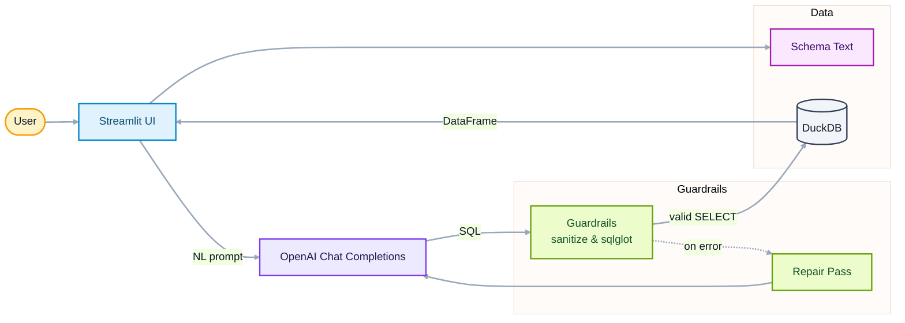
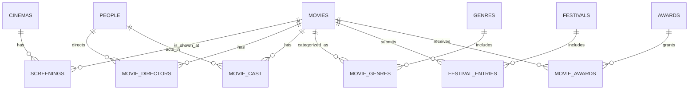

# 🎬 NaturalQL

NaturalQL is a **natural‑language → SQL** demo with **guardrails**. Ask a question, get a safe SQL query, and see results from a small cinema dataset. Built for interviews and rapid prototyping.

---

## ✨ Features

* **NL → SQL** via OpenAI (DuckDB dialect)
* **Guardrails:** SELECT‑only, enforced `LIMIT`, schema‑bounded generation, SQL parsing + alias‑aware validation, single repair loop
* **Deterministic time phrases** (e.g., *“this summer”*) resolved against a fixed demo date
* **Streamlit UI** with two tabs: *Query* and *About*, optional *Show SQL* + *Explain SQL*
* **Zero‑ops DB:** DuckDB file, auto‑seeded with a realistic film schema

---

## 🧱 Architecture



```
naturalql/
├─ app.py                 # Streamlit UI
├─ requirements.txt
└─ src/naturalql/
   ├─ __init__.py
   ├─ config.py           # settings (model, db path, today, limits)
   ├─ db.py               # DDL + seeding + schema helpers
   ├─ guards.py           # sanitize + sqlglot validation (alias-aware)
   ├─ llm.py              # prompts: generate/repair/explain
   └─ nlp.py         # tiny NL preprocessor for date phrases
```

**Data model (tables):** 

`cinemas, movies, people, movie_directors, movie_cast, genres, movie_genres, festivals, festival_entries, awards, movie_awards, screenings`.



---

## ⚙️ Setup

### Recommended Stack

* Python 3.11 (DuckDB wheels are most stable on 3.11). 3.12 works, but see troubleshooting.
* Poetry ≥ 1.6
* OpenAI API key (sign up at [https://platform.openai.com](https://platform.openai.com))
* VSCode (optional, but recommended) - with Mermaid extension for architecture diagrams

## 1) Install dependencies

```bash
poetry install
```

### Create a `.env` file (kept out of git)

Create a file named **`.env`** in the project root with your configuration:

```ini
# Required
OPENAI_API_KEY=sk-...

# Optional (defaults shown)
NQL_MODEL=gpt-4o-mini
NQL_DB_PATH=naturalql.duckdb
NQL_RESULT_LIMIT=50
NQL_TODAY=2025-09-10   # fixes relative time phrases for demo
```

Ensure `.env` is ignored by git (add this to `.gitignore` if not present):

```gitignore
.env
```

## ▶️ Run

```bash
poetry run streamlit run src/naturalql/app.py
```

Then open the printed local URL (typically [http://localhost:8501](http://localhost:8501)).

---

## 🧪 Try these queries

* *“Show all new Sci-Fi movies screened at Cinema Luna between 1 Jun and 31 Aug 2025, directed by debut directors, that never participated in A or S ranked festivals, share no cast member with any award-winning movie, have runtime ≥ 100 minutes, and were shown in 2D (not IMAX).”*
* *“For each cinema, count how many new releases were screening in August 2025.”*
* *“List movies released in 2025 with their directors and primary genre.”*
* *“Find actors who worked with more than one director.”*
* *“Which movies screening at Cinema Luna in July 2025 have no festival participation?”*

Tip: tick **Show generated SQL** to display the query.

---

## 🛡️ Guardrails (how it stays safe)

* **Sanitization:** rejects non‑SELECT statements, removes semicolons, enforces `LIMIT`
* **Schema bounding:** prompts include the exact schema; unknown tables/columns rejected
* **Static checks:** `sqlglot` parsing + alias resolution; friendly hints (e.g., `festival_rank`)
* **Repair loop:** if first attempt fails, a single error‑aware retry is attempted

---

## 🧩 Design choices (talking points)

* **DuckDB**: file‑based, fast, no server setup
* **Prompt rules**: codified compliance (time windows → date overlaps, GROUP BY requirements)
* **Determinism**: fixed TODAY date + tiny time normalizer for *“this summer”* etc.
* **Extensibility**: swap OpenAI model, change DB, or add self‑verification

---

## 🔧 Extending

* **Self‑verification**: second pass that critiques SQL (columns, joins, predicates)
* **Caching/telemetry**: `st.cache_data`, timing, token & latency logs
* **Row‑level security / column whitelist**: restrict sensitive tables/fields
* **Postgres**: replace `duckdb` connector; adjust `sqlglot` dialect if needed
* **Domain glossary**: map user synonyms to schema terms pre‑prompt

---

## 🧭 Demo script (5 minutes)

1. Briefly show the *About* tab: architecture + guardrails
2. Run 2–3 queries; show the SQL and results
3. Trigger a failure (e.g., use `rank` instead of `festival_rank`) and show the friendly error
4. Mention extensions: self‑verification, RLS, Postgres swap, cost tracking

---

## 🩺 Troubleshooting

* **“Only SELECT queries are allowed.”** → The generator tried DDL/DML; click *Generate & Run* again or simplify wording
* **“Unknown table in column reference: m”** → Fixed by alias‑aware validator; if seen, update `guards.validate_with_sqlglot`
* **“Use festivals.festival\_rank instead of 'rank'.”** → Adjust the query; `rank` is a window function name
* **Empty results for time windows** → Ensure phrases are resolved for 2025 (see `NQL_TODAY` or `nlp.py`)
* **OPENAI\_API\_KEY not set** → export it in the same terminal that runs Streamlit

---

## 📄 License

MIT (for demo/educational purposes)
