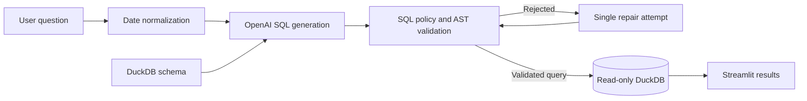

# NaturalQL

NaturalQL is a Streamlit app that turns plain-English questions into SQL and
runs them against a DuckDB cinema database. Before execution, generated queries
are checked for read-only behavior and references to the known schema.

OpenAI generates the SQL, sqlglot parses and validates it, and DuckDB provides a
local dataset covering movies, screenings, casts, festivals, and awards.


## What it demonstrates

- Natural-language to DuckDB SQL over a known schema
- AST-based validation of statements, tables, columns, scopes, and aliases
- Read-only query execution with external access disabled
- Deterministic handling of supported relative date phrases
- One bounded repair attempt when generated SQL fails validation
- A local, reproducible dataset with no database service to provision

## Architecture



The model is not a security control. Generated text is treated as untrusted and
must pass the same validation pipeline on both the initial and repair attempts.
See [Security and reliability](docs/security.md) for the enforced guarantees and
known limitations. The dataset is described in [Data model](docs/tables.md).

## Query policy

Before execution, NaturalQL:

1. Parses exactly one DuckDB query.
2. Rejects mutations, database commands, and external file or network sources.
3. Resolves tables, aliases, scopes, and columns against the live schema.
4. Applies configured SQL-size and AST-complexity bounds.
5. Adds or caps the outer `LIMIT`.
6. Executes the result through a separate read-only connection.

This boundary limits what generated SQL can access or modify. It does not prove
that a valid query correctly represents the user's intent, nor does a row limit
bound the work performed by the database.

## Setup

NaturalQL supports Python 3.11 and 3.12 and uses
[Poetry](https://python-poetry.org/) for dependency management.

```bash
poetry install
cp .env.example .env
```

Set `OPENAI_API_KEY` in `.env`. The file is ignored by Git; `.env.example`
documents all supported settings without containing credentials.

Run the application:

```bash
poetry run streamlit run src/naturalql/app.py
```

## Example questions

- List movies released in 2025 with their directors and primary genre.
- For each cinema, count new releases screening in August 2025.
- Which movies at Cinema Luna in July 2025 had no festival participation?
- Find actors who worked with more than one director.

The included cinema dataset is deliberately small, but its many-to-many
relationships exercise joins, aggregates, anti-joins, and date-window logic.

## Development

Run the same checks used in CI:

```bash
poetry run ruff format --check .
poetry run ruff check .
poetry run pytest
poetry check
```

Tests do not call OpenAI and do not require an API key. Model responses are
mocked so validation and repair behavior remain deterministic.

## Project status

NaturalQL is an educational, single-user demonstration rather than a production
authorization layer. Production use would additionally require database roles,
resource and time limits, audit logging, monitoring, and domain-specific access
control.

## License

Licensed under the [MIT License](LICENSE).
