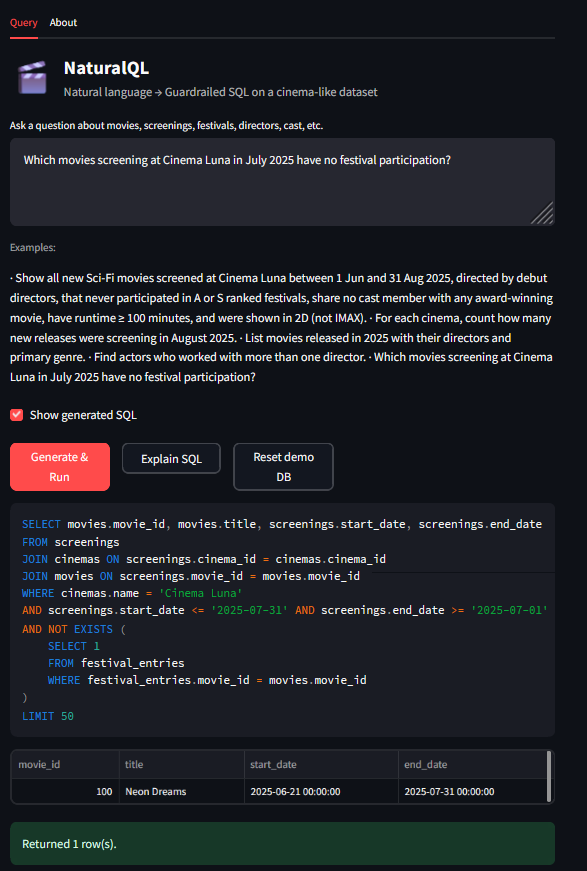
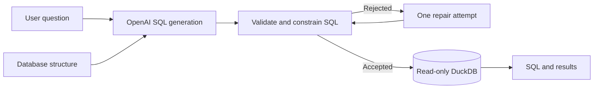

# NaturalQL 🎬

> AI-based Natural language to SQL translator with safety guardrails.

Ask a question about your data in plain English. NaturalQL generates the SQL,
checks it, runs it, and shows you both the query and the answer.

For example:

> Which movies screening at Cinema Luna in July 2025 had no festival
> participation?

NaturalQL turns that into a multi-table DuckDB query, validates every table and
column, and returns the matching movies—all from the Streamlit interface.



## Highlights

- Generate DuckDB SQL from natural-language questions with OpenAI.
- Inspect the generated SQL alongside the results.
- Block writes, unknown tables and columns, multiple statements, and external
  data sources before execution.
- Refuse questions that do not relate to the available movie data.
- Run accepted queries through a read-only database connection.
- Repair an invalid query once, then validate it again from scratch.
- Explore a ready-to-use movie database with cinemas, screenings, casts,
  festivals, and awards.

## How it works



The LLM proposes SQL but never gets direct database access. NaturalQL parses
its output with sqlglot, checks it against the actual database structure, and
only sends accepted SQL to DuckDB.

### Guardrails

- Exactly one query statement
- At least one table from the application database
- Known tables and columns only, including aliases and nested queries
- No writes, database commands, or external file and network sources
- Configurable limits on returned rows, SQL length, and query complexity
- Separate read-only connection with DuckDB external access disabled

These controls restrict what generated SQL can do; they do not guarantee that
the query perfectly captures the user's intent. See
[Security and reliability](docs/security.md) for the full boundary and
production considerations.

## Run locally

NaturalQL supports Python 3.11 and 3.12 and uses
[Poetry](https://python-poetry.org/) for dependency management.

```bash
poetry install
cp .env.example .env
```

Add your `OPENAI_API_KEY` to `.env`, then start the app:

```bash
poetry run streamlit run src/naturalql/app.py
```

The `.env` file is ignored by Git. `.env.example` documents every available
setting without containing credentials.

## Questions to try

- List movies released in 2025 with their directors and primary genre.
- For each cinema, count new releases screening in August 2025.
- Which movies at Cinema Luna in July 2025 had no festival participation?
- Find actors who worked with more than one director.

The [data model](docs/tables.md) shows the relationships behind these questions.

## Development

```bash
poetry run ruff format --check .
poetry run ruff check .
poetry run pytest
poetry check --lock
```

CI runs formatting, linting, secret scanning, and the test suite on Python 3.11
and 3.12. The tests mock OpenAI responses, require no API key, and enforce 100%
statement and branch coverage across the core application modules.

## License

Licensed under the [MIT License](LICENSE).
