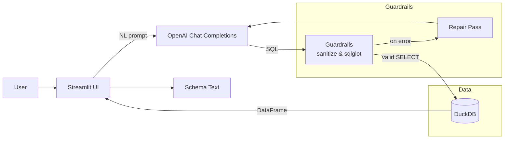

```mermaid
flowchart LR
  U[User] --> UI[Streamlit UI]
  UI -->|NL prompt| LLM[OpenAI Chat Completions]
  UI --> SCH[Schema Text]
  LLM -->|SQL| GR[Guardrails<br/>sanitize &amp; sqlglot]
  GR -->|valid SELECT| DB[(DuckDB)]
  GR -->|on error| RP[Repair Pass]
  RP --> LLM
  DB -->|DataFrame| UI

  subgraph Guardrails
    GR
    RP
  end
  subgraph Data
    DB
  end
```