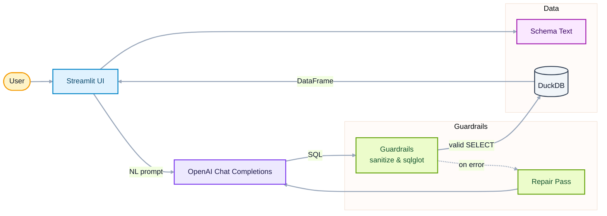

```mermaid
%%{init: {
  "theme": "base",
  "themeVariables": {
    "fontFamily": "Inter,Segoe UI,Arial,Helvetica,sans-serif",
    "primaryColor": "#E0F2FE",
    "primaryBorderColor": "#0284C7",
    "primaryTextColor": "#0F172A",
    "lineColor": "#94A3B8"
  }
}}%%
flowchart LR
  classDef user  fill:#FEF3C7,stroke:#F59E0B,stroke-width:2px,color:#111827;
  classDef ui    fill:#E0F2FE,stroke:#0284C7,stroke-width:2px,color:#0C4A6E;
  classDef llm   fill:#EDE9FE,stroke:#7C3AED,stroke-width:2px,color:#1E1B4B;
  classDef guard fill:#ECFCCB,stroke:#65A30D,stroke-width:2px,color:#14532D;
  classDef data  fill:#FAE8FF,stroke:#A21CAF,stroke-width:2px,color:#3B0764;
  classDef db    fill:#F1F5F9,stroke:#334155,stroke-width:2px,color:#0F172A;

  U([User]):::user --> UI[Streamlit UI]:::ui
  UI -->|NL prompt| LLM[OpenAI Chat Completions]:::llm
  UI --> SCH[Schema Text]:::data
  LLM -->|SQL| GR[Guardrails<br/>sanitize &amp; sqlglot]:::guard
  GR -->|valid SELECT| DB[(DuckDB)]:::db
  GR -. on error .-> RP[Repair Pass]:::guard
  RP --> LLM
  DB -->|DataFrame| UI

  subgraph Guardrails
    GR
    RP
  end
  subgraph Data
    SCH
    DB
  end

  linkStyle default stroke:#94A3B8,stroke-width:2.2px,opacity:0.95
```