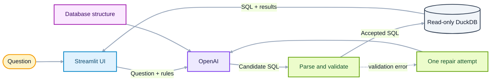

# Architecture

NaturalQL has one job: turn a question into SQL without letting generated text
go straight to the database. The application is intentionally small, so the
entire path from prompt to result can be followed in one diagram.

## The request path

1. **Streamlit collects the question.** Supported relative phrases such as
   “this summer” are converted into explicit dates using a configured reference
   date.
2. **OpenAI proposes SQL.** The prompt includes the database tables and columns,
   the DuckDB dialect, and rules for common joins and filters.
3. **The application validates the proposal.** sqlglot parses the SQL into an
   abstract syntax tree, or AST. Working with the parsed structure avoids the
   false positives and gaps of searching raw text for keywords.
4. **DuckDB runs accepted SQL.** Generated queries use a separate read-only
   connection with external access disabled.
5. **Streamlit shows the evidence.** The user can inspect the SQL next to the
   returned rows and ask for an explanation of that exact query.

## Why the repair loop is bounded

If the first query fails validation, NaturalQL sends the error and the database
structure back to the model once. The repaired query receives no special trust:
it starts at the beginning of the same validation process.

One attempt is enough to demonstrate useful recovery without creating an
open-ended agent loop, unpredictable latency, or repeated API costs.

## Connection boundaries

Database setup and reset are trusted application operations. They use a
short-lived connection that can create and populate tables. Model-generated SQL
never uses that connection; it reaches only the read-only query connection.

This separation complements the SQL validator. A bug in one layer should not
silently turn generated SQL into a database write.
