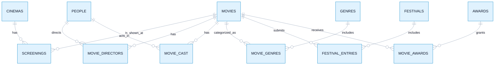

# Data model

NaturalQL ships with a small movie database that works immediately after the
app starts. It is familiar enough to explore without documentation, but rich
enough for realistic SQL involving joins, grouping, date ranges, and “never”
conditions.

For example, the data can answer:

- Which films were showing at a particular cinema during a date range?
- Who directed and acted in each film?
- Which films entered a festival or won an award?
- Which cast members have never appeared in an award-winning film?

## Table groups

### Films and people

- `movies` stores titles, release dates, runtimes, countries, languages,
  ratings, and box-office values.
- `people` represents both actors and directors.
- `movie_directors` links films to directors and records whether a film is a
  director's debut.
- `movie_cast` links films to actors and their role names.

### Classification and recognition

- `genres` and `movie_genres` give films one or more genres.
- `festivals` records the festival, year, and ranking.
- `festival_entries` connects films to festival competitions.
- `awards` and `movie_awards` record nominations and winners.

### Cinema schedules

- `cinemas` contains venue names and cities.
- `screenings` connects a film to a cinema over a start and end date. It also
  records the presentation format and whether the screening is a new release.

The application reads this structure directly from DuckDB. The same table and
column names are given to the model and used by the validator, which prevents
the prompt and enforcement layer from drifting apart.
